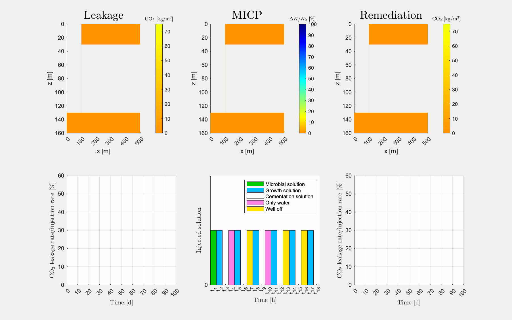

# ad-micp: A module to study CO2 leakage remediation by microbially induced calcite precipitation (MICP)

## Description
MICP is a new and sustainable technology which utilizes biochemical
processes to create barriers by calcium carbonate cementation; therefore,
this technology has a potential to be used for sealing leakage zones in
geological formations. We have implemented a mathematical model for MICP
suitable for field-scale studies. Further information on the mathematical
model can be found in the two publications [A, B] in the "Cite" part of
this README.

The numerical examples accompanying this module are:
* runMICP1DCase.m and
* runMICP3DCase.m.

In addition, this module includes scripts to run the studies in [A, B].

The ad-micp module is compatible with the (freely available) MATLAB
Reservoir Simulation Toolbox (MRST) provided by SINTEF Digital, see
http://www.sintef.no/projectweb/mrst/.

See the Wiki for an extended description, information regarding changes
respect to previous releases, and using this module in macOS with GNU
Octave.

## Requirements
* MRST (Tested version: 2021b)
* MATLAB (Tested version: R2021a) or GNU Octave (Tested version: 6.3.0)

## Installation (MATLAB)
* Set the folder's name to 'ad-micp'.
* Move the folder inside the 'modules' folder in MRST.
* Run the 'startup.m' file in MRST.

## Installation (GNU Octave)
* Set the folder's name to 'ad-micp'.
* Move the folder inside the 'modules' folder in MRST.
* Run the 'startup.m' file in MRST.
* Open the script 'mrst-2021a/utils/uniqueStable.m' and comment the lines
104, 112, 115, and 117 (this forces to use the function 'fall_back' in
line 110 instead of the function 'unique' in line 115).
* Open the scripts 'mrst-2021a/models/co2lab/utils/co2props/CO2props.m' and
'mrst-2021a/models/co2lab/utils/co2props/SampleProp2D.m' and change the
name of the function 'fields' to 'fieldnames' in lines 120 and 484
respectively.

## Cite
If you use ad-micp to write a scientific publication, please cite one of
the following papers:
* [A] Landa-Marbán, D., Tveit, S., Kumar, K., Gasda, S.E., 2021.
Practical approaches to study microbially induced calcite precipitation
at the field scale. Int. J. Greenh. Gas Control 106, 103256.
https://doi.org/10.1016/j.ijggc.2021.103256.
* [B] Landa-Marbán, D., Kumar, K., Tveit, S., Gasda, S.E.
Numerical studies of CO2 leakage remediation by micp-based plugging
technology. In: Røkke, N.A. and Knuutila, H.K. (Eds) Short Papers from the
11th International Trondheim CCS conference, ISBN: 978-82-536-1714-5,
284-290.

## Contact
David Landa-Marbán (dmar@norceresearch.no).
