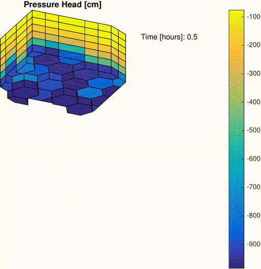

# RE-MPFA

## Description
This module implements a discretization of the (three-dimensional) incompressible Richards' equation using 
cell centered finite volume methods, specifically Multi-Point Flux Approximation. 

Due to the non-linear nature of the water retention curves (van Genuchten-Mualem), the resulting set of 
partial differential equations is also non-linear. To approximate the solutions at each time step, 
we use a classical Newton iterative scheme, where the Automatic Differentiation capabilities
of MRST are exploited. 

Examples of usage for three ilustrative scenarios can be found in:
* waterInfiltration1D.m  
* waterInfiltration3D.m
* waterEvaporation3D.m

For more information on the MPFA discretization, we refer to:
   I. Aavatsmark: An introduction to multipoint flux approximations for quadrilateral grids, Comput. Geosci. 6(3-4) 405-432.

## Requirements
The module is compatible with the (freely available) Matlab Reservoir Simulation
Toolbox (MRST) provided by SINTEF ICT: http://www.sintef.no/projectweb/mrst/
In particular, the grid data structure is that of MRST, and it is assumed that 
MRST is in the MATLAB path.

Also, it is assumed that the [fvbiot package](https://github.com/pmgbergen/fvbiot)(freely available) which provides the discretization of the flux is in the MATLAB path as well. The fvbiot package was developed by [Eirik Keilevgalen](https://www.uib.no/personer/Eirik.Keilegavlen) from the [Porous Media Group](https://pmg.w.uib.no/) of the University of Bergen. 

The code has been tested with Matlab R2019a and mrst-2019a.

## Tips
We highly recommend you to use the MATLAB publish tool, where you will be able to go through each section of the scripts, which were carefully documented.

## Cite
If you use RE-MPFA, please cite:
Varela, J. (2018). Implementation of an MPFA/MPSA-FV Solver for the Unsaturated Flow in Deformable Porous Media (Master's thesis, The University of Bergen).

## Bugs/Contacts
You can report bugs or make consultations by e-mailing: 
Jhabriel Varela (jhabriel.varela@uib.no).
